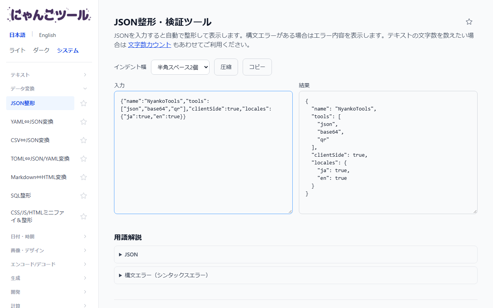

# NyankoTools（にゃんこツール）

[](https://github.com/nyankotools/nyankotools/actions/workflows/ci.yml)

**🐾 デモ / 公開サイト: [nyankotools.com](https://nyankotools.com)**（[English](https://nyankotools.com/en/)）

ブラウザだけで完結する、開発者・クリエイター向けの無料Webツール集です。JSON整形、Base64、QRコード生成、PDF→Markdown変換など、テキスト変換・データフォーマット・計算機・ジェネレーターといったツールを、日本語・英語で提供しています。ツールは順次追加しています。

**すべての処理はブラウザ内（クライアントサイド）で完結し、入力データが外部サーバーに送信されることは一切ありません。** バックエンドを持たない静的サイトです。

|              トップページ               |                 ツールの画面（JSON整形）                 |
| :-------------------------------------: | :------------------------------------------------------: |
|  |  |

> A collection of browser-only developer & creator tools (JSON, Base64, QR code, PDF→Markdown, and more), available in Japanese and English. Everything runs client-side — no data ever leaves your browser.

---

以下は、このリポジトリ（サイトのソースコード）の開発者向け情報です。

## 特徴

- **完全クライアントサイド**: API・バックエンドなし。プライバシー保護とゼロホスティングコストを両立。
- **多数のツール**: テキスト処理・データ変換・エンコード/デコード・生成系・開発支援・計算機・PDFなど。
- **日本語 / 英語対応**: 全ページが `ja`（`/tools/...`）・`en`（`/en/tools/...`）の両ロケールを提供。
- **SEO志向**: ツールごとに個別の title/description、内部リンク、構造化データ、サイトマップを整備。
- **レスポンシブ**: モバイル（375px前後）でも崩れないレイアウト。

## 技術的なこだわり

- **静的サイトのまま、重い処理もブラウザ内で**: PDFの処理など、サーバーが必要に見える機能もクライアントだけで実装しています（PDFパスワード保護では wasm を利用）。
- **CSP（Content-Security-Policy）を設定し、本番ビルドでE2E検証**: 開発サーバー（`astro dev`）はCSPヘッダーを返さないため、E2Eは `pnpm build && pnpm preview` のビルド結果に対して実行します。CSPで壊れる処理（wasm や `fetch` など）も、実際に動かして確認しています。
- **ロジックとUIの分離**: ツールのロジックは `src/lib/tools/<slug>.ts` のフレームワーク非依存の純粋関数に切り出し、Vitest でテストします。UI フレームワークのアイランドは使いません。
- **レジストリ駆動**: `src/data/tools.ts` の1ファイルが、トップページ・サイドバー・共通E2E（サイドバー遷移、375px幅でのはみ出し、h1表示）を駆動します。ツールを増やしても、共通の品質チェックが自動で広がります。
- **i18n は辞書 + 共有コンポーネント**: 日英のページが同じコンポーネントを共有し、文言だけを辞書（`src/i18n/`）で切り替えます。

## ドキュメントの読み順

1. [`docs/spec.md`](./docs/spec.md) — サイトの仕様書。
2. [`.claude/docs/architecture.md`](./.claude/docs/architecture.md) — 技術スタック、ディレクトリ構成、データの流れ。
3. [`.claude/docs/conventions.md`](./.claude/docs/conventions.md) — コーディング規約、ツールロジックの構成、テスト方針。
4. [`.claude/docs/adding-a-tool.md`](./.claude/docs/adding-a-tool.md) — ツールを1つ追加するときのチェックリスト。
5. [`.claude/docs/deployment.md`](./.claude/docs/deployment.md) / [`.claude/docs/growth.md`](./.claude/docs/growth.md) — デプロイ設定、SEO・レスポンシブ・i18n の方針。

## AIを活用した開発

このリポジトリは [Claude Code](https://claude.com/claude-code) を使って開発しています。プロジェクトのルールは [`CLAUDE.md`](./CLAUDE.md) と [`.claude/`](./.claude/)（ドキュメント、レビュー/QA専用エージェント、スラッシュコマンド）にまとめています。

## スタック

| レイヤー       | 技術                                                                 |
| -------------- | -------------------------------------------------------------------- |
| フレームワーク | [Astro](https://astro.build/)（`output: static`、SSRアダプターなし） |
| スタイリング   | Tailwind CSS v4（`@tailwindcss/vite`）                               |
| 言語           | TypeScript                                                           |
| テスト         | Vitest（ユニット） / Playwright（E2E）                               |
| デプロイ先     | Cloudflare Workers（静的アセット配信）                               |
| パッケージ管理 | pnpm（Corepack 経由）                                                |

詳細は [`.claude/docs/architecture.md`](./.claude/docs/architecture.md) を参照。

## セットアップ

```bash
pnpm install
```

Node.js `>=22.13.0` が必要です（`package.json` の `engines` 参照）。

## コマンド

```bash
pnpm dev              # 開発サーバー起動 (http://localhost:4321)
pnpm build            # 本番ビルド（dist/ に出力）
pnpm preview          # ビルド結果をローカルでプレビュー
pnpm exec astro check # 型チェック
pnpm run lint         # ESLint
pnpm run format       # Prettier --write
pnpm test             # Vitest（一括実行）
pnpm run test:watch   # Vitest（ウォッチモード）
pnpm run test:e2e     # Playwright E2E
pnpm run test:e2e:ui  # Playwright E2E（UIモード）
```

## ディレクトリ構成

```
src/
  data/tools.ts              # ツールレジストリ（ja/en の name/description/category）
  i18n/
    ui.ts                    # サイト共通UI文言（サイドバー・フッター等）
    tools/<slug>.ts          # ツールページ専用の文言辞書（ja/en）
  components/
    tool-pages/<Slug>Page.astro  # 各ツールの共有マークアップ + <script>（locale prop で出し分け）
    Glossary.astro, ShareButtons.astro
  layouts/
    Layout.astro              # 全ページ共通の <head>（SEO/OGP/hreflang）とサイドバーシェル
  lib/
    tools/<slug>.ts           # 各ツールのロジック（フレームワーク非依存の純粋関数、テスト対象）
  pages/
    index.astro                # トップページ（ja）
    en/                        # 英語版ページ群
    tools/<slug>/index.astro   # 各ツールのページ（ja、共有コンポーネントの薄いラッパー）
    about/, contact/, faq/, privacy-policy/, terms-of-service/
  styles/global.css
e2e/                          # Playwright E2E テスト（*.spec.ts）
docs/spec.md                  # 仕様書
```

新規ツール追加の手順は [`.claude/docs/adding-a-tool.md`](./.claude/docs/adding-a-tool.md) を参照してください。

## 開発フロー（このリポジトリ固有のルール）

このリポジトリを Claude Code で扱う場合、ツールの追加・修正後は **実装 → レビュー（`tool-reviewer`）→ テスト（`tool-qa`）** の順で確認する運用になっています。人手で開発する場合も、コミット前に以下を通すことを推奨します。

```bash
pnpm exec astro check && pnpm run lint && pnpm test && pnpm build
```

詳細は [`CLAUDE.md`](./CLAUDE.md) を参照してください。

## デプロイ

Cloudflare Workers（静的アセット配信）に `pnpm build` の成果物（`dist/`）をデプロイします。設定は `wrangler.jsonc` を参照。詳細は [`.claude/docs/deployment.md`](./.claude/docs/deployment.md)。

## ライセンス

**All rights reserved.** このリポジトリは閲覧・参照のみを目的として公開しており、オープンソースではありません。権利者の許諾なく、無断転載・複製・改変・再配布・商用利用を行うことはできません。詳細は [`LICENSE`](./LICENSE) を参照してください。

## 運営方針

- このリポジトリは個人運営です。**Issue・Pull Request・Discussion は受け付けていません。**
- 不具合やご要望は、[nyankotools.com](https://nyankotools.com) のサイト内の案内からご連絡ください。
